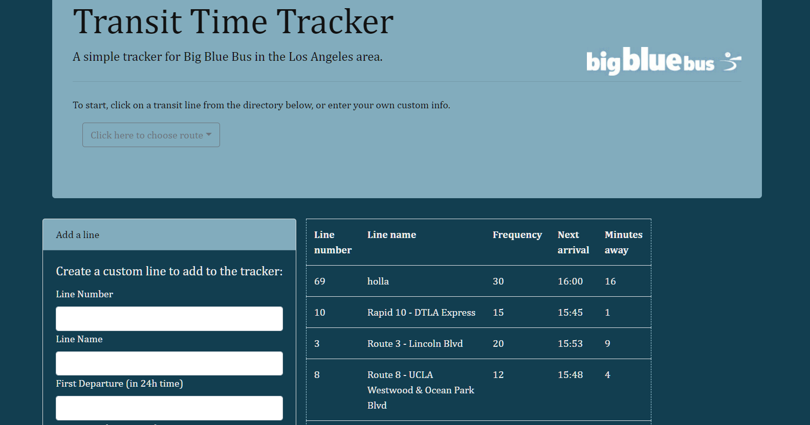

# Big Blue Bus transit tracker
#### A simple form/table app for tracking transit

This app's database is initialized with focus on Los Angeles transit and features a directory for a subset of LA's bus transit system, the Big Blue Bus.

Transit lines can be chosen from the directory to add them to the tracker, or enter your own custom line info.

(BBB line information provided is entirely inaccurate and is only used as seed data for this app)

Ideally, I would be able to add accurate timetables and account for AM/PM instead of using 24-hour time formatting. I initially had a very hard time with moment.js syntax.

This app was built as an introduction exercise to using Firebase and external JS libraries. It uses HTML5, CSS3, and jQuery with Bootstrap 4 for mobile responsiveness.